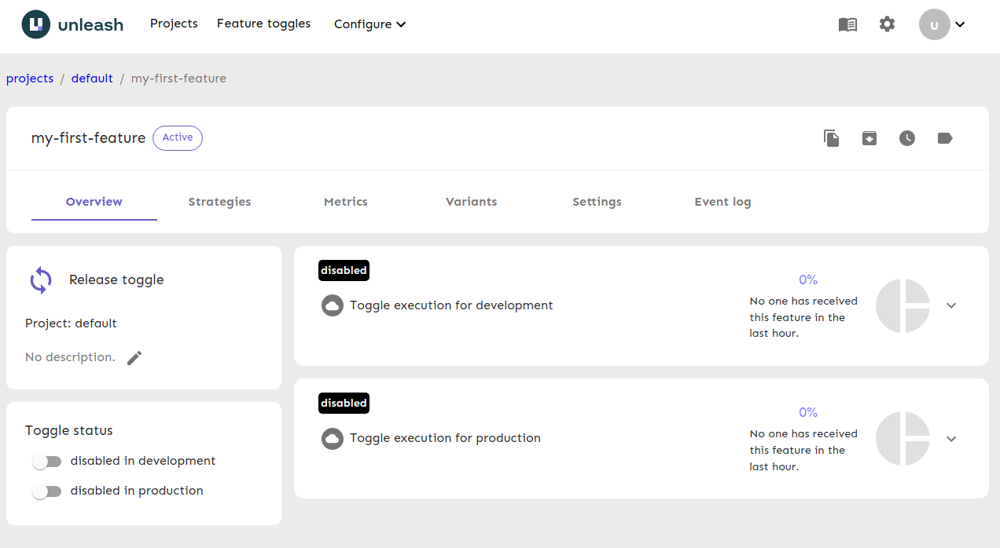

+++
date = "2021-12-16T15:11:00+07:00"
author = "anhpngt"
description = "Self-hosting Unleash with Kubernetes"
title = "Self-hosting Unleash with Kubernetes"
categories = ["DevSecOps", "Feature"]
tags = ["unleash", "k8s", "helm"]
slug = "unleash-self-host"
+++

In this blog post, we will learn how to self-host Unleash in a Kubernetes cluster.

### Why feature toggles?

While developing new features for our end-users, we often encounter these 2 problems:

- Features are not developed and rolled out in a single night. It often takes several days or even
weeks before a feature is fully developed, tested, and deployed. In such cases, we usually have to
deploy a piece of that feature to production, and we would need to hide that piece until the feature
is fully completed and ready.
- Even after the feature reaches end-users, until we are fully confident in the feature, fail-safe
methods are usually employed. One of such methods is to hide the feature away from the users to prevent
it from being used.

With the feature toggle, we then can simply turn the feature's flag off and on to hide or show the
feature to users.

### Why Unleash?

Before [Unleash](https://www.getunleash.io/), we have tried [Firebase Remote Config](https://firebase.google.com/docs/remote-config)
to some success. However, what it did not have was **a local deployment or an emulator**.
This feature was crucial to us, because:

1. Local development: in Manabie, any developer can spin up the entire end-to-end infrastructure
in their own machine and start working on their task without having to worry about breaking any
of the production clusters. However, Firebase Remote Config is a shared instance. Using Firebase
would not meet our separation-of-concern's standards.
2. CI/CD: when running end-to-end tests, it is desirable to run the tests against different feature
toggle configurations. We need to ensure that our code works with both cases of the flag being turned
on and off. It would be disastrous if it does not.

### Deploying Unleash in a Kubernetes cluster

#### 1. Prerequisites

- [kubectl](https://kubernetes.io/docs/tasks/tools/#kubectl)
- [minikube](https://minikube.sigs.k8s.io/docs/)
- [helm](https://helm.sh/)
- curl

Using `helm` is a bit of an overkill here. However, our Manabie's CI/CD pipeline uses `helm` to deploy
so we will use it here as well.

For this guide, I am using the following versions



The versioning requirements are not strict. However, if you encounter any strange errors, you can
try installing the listed versions first.

#### 2. Setting up the project

First, clone the example from Github repository:

```sh
    git clone https://github.com/manabie-com/manabie-com.github.io
```

Then, let's start `minikube` and cache some required images. With this, we will not have to
re-download them everytime we start `minikube`.

```sh
    minikube start
    minikube cache add postgres:14.1-alpine3.15
    minikube cache add unleashorg/unleash-server:4.3.1
    minikube cache add unleashorg/unleash-proxy:0.4.0
```

the output will be similar to this:

```sh
    😄  minikube v1.24.0 on Ubuntu 21.10
    ✨  Automatically selected the docker driver
    👍  Starting control plane node minikube in cluster minikube
    🚜  Pulling base image ...
    🔥  Creating docker container (CPUs=2, Memory=7900MB) ...
    🐳  Preparing Kubernetes v1.22.3 on Docker 20.10.8 ...
        ▪ Generating certificates and keys ...
        ▪ Booting up control plane ...
        ▪ Configuring RBAC rules ...
    🔎  Verifying Kubernetes components...
        ▪ Using image gcr.io/k8s-minikube/storage-provisioner:v5
    🌟  Enabled addons: storage-provisioner, default-storageclass
    🏄  Done! kubectl is now configured to use "minikube" cluster and "default" namespace by default
    ❗  "minikube cache" will be deprecated in upcoming versions, please switch to "minikube image load"
    ❗  "minikube cache" will be deprecated in upcoming versions, please switch to "minikube image load"
    ❗  "minikube cache" will be deprecated in upcoming versions, please switch to "minikube image load"
```

#### 3. Deploying Unleash

##### 1. Unleash server

Because we have not installed anything yet, there should be nothing in the `default` namespace.
Let's check:

```sh
    $ kubectl get pods
    No resources found in default namespace.
```

If you encounter errors like `The connection to the server localhost:8080 was refused - did you specify the right host or port?`,
then probably you have not run `minikube start` yet.

If everything is fine, we can proceed to installing `unleash` in our cluster:

```sh
    $ cd manabie-com.github.io/content/posts/unleash-self-host/examples
    $ helm upgrade --wait --timeout 1m --install unleash ./ -f values.yaml
    Release "unleash" does not exist. Installing it now.
    NAME: unleash
    LAST DEPLOYED: Fri Dec 17 14:55:30 2021
    NAMESPACE: default
    STATUS: deployed
    REVISION: 1
    TEST SUITE: None
```

Checking the pods again

```sh
    $ kubectl get pods
    NAME                       READY   STATUS    RESTARTS      AGE
    unleash-77df4956fc-xnqft   2/2     Running   1 (96s ago)   97s
```

The status is `Running` and readiness is `2/2`, so it is ready to serve requests.

To access the server, we need to expose it from within `minikube` cluster to our host machine
by port-forwarding in a separate terminal:

```sh
    $ kubectl port-forward deploy/unleash 4242
    Forwarding from 127.0.0.1:4242 -> 4242
    Forwarding from [::1]:4242 -> 4242
```

Go to `http://localhost:4242/unleash` in your browser, you should see the Unleash login page:


Login with the default account that Unleash created for us:

- Username: `admin`
- Password: `unleash4all`

then you will go to the `features` page (which is empty right now since we have not added
any feature flags yet). We will add them in the next section.


##### 2. Add new feature flags and test them

In the Unleash features page `http://localhost:4242/unleash/features`, click on `Create feature toggle`.
Choose:

- Name: `my-first-feature`
- Toggle type: `Release`
- Description can be left empty

then press `Create`. You should see `my-first-feature` toggle:



By default, clients do not have access to the server since we are enabling authentication for Unleash.
You need to follow [this guide](https://docs.getunleash.io/user_guide/api-token) to create an API
token. I am adding a new API token with:

- Username: `client`
- Token Type: `Client`
- Project: `ALL`
- Environment: `default`

