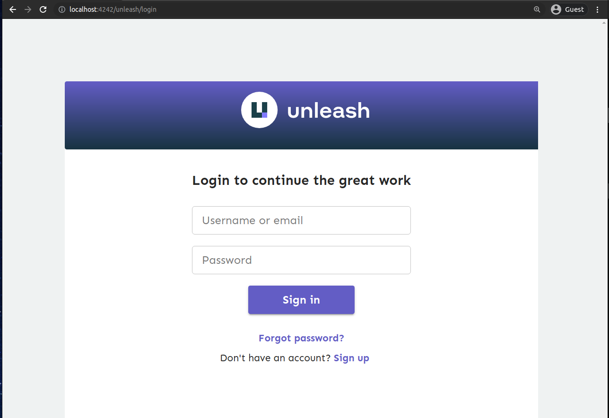
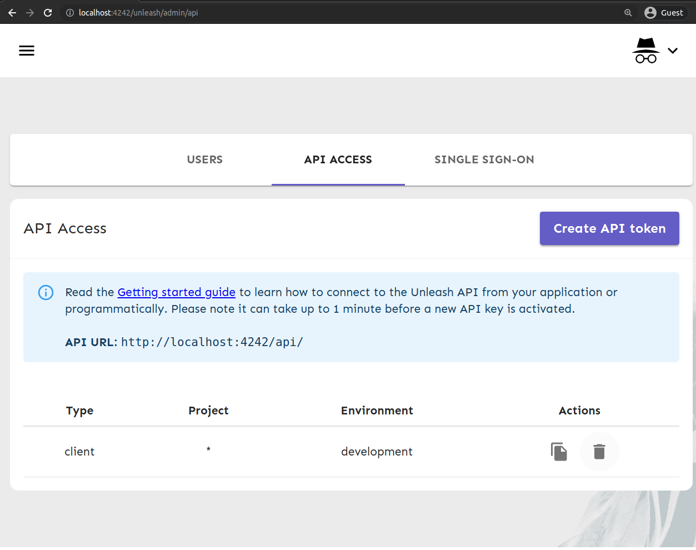
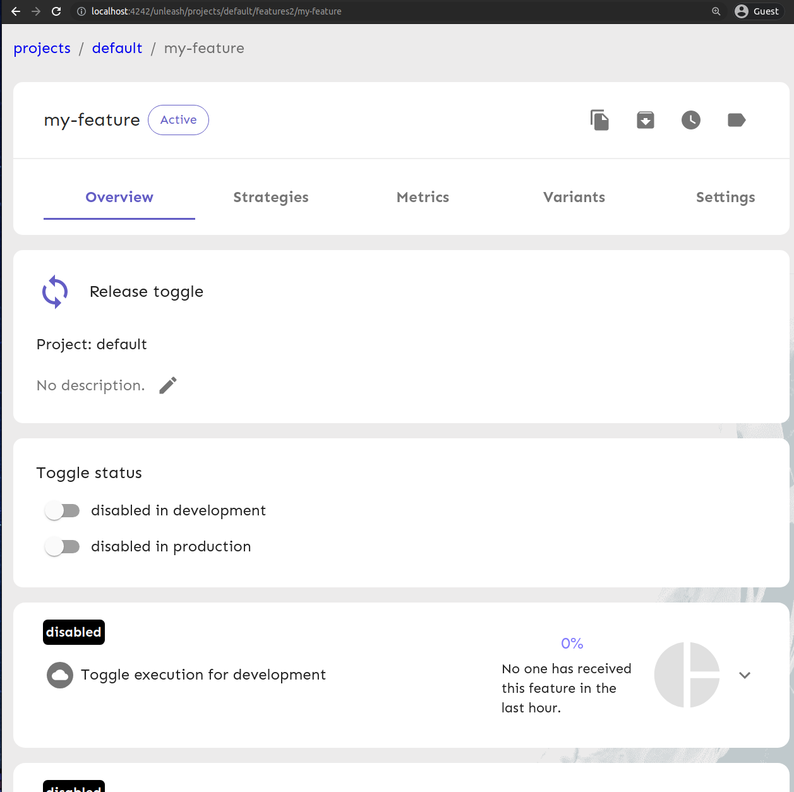
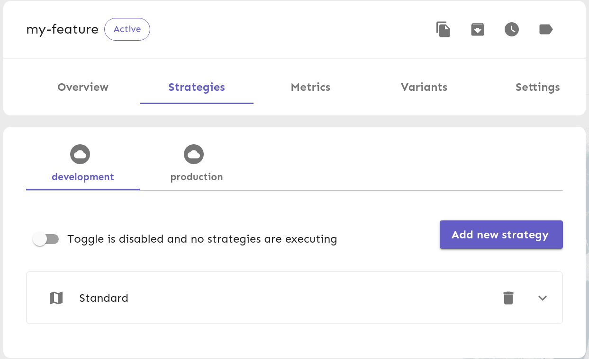

+++
date = "2021-12-17T21:24:00+07:00"
author = "anhpngt"
description = "Self-hosting Unleash with Kubernetes"
title = "Self-hosting Unleash with Kubernetes"
categories = ["DevSecOps", "Feature"]
tags = ["unleash", "k8s", "helm"]
slug = "unleash-self-host"
+++

In this blog post, we will learn how to self-host Unleash in a Kubernetes cluster.

### Why feature toggles?

While developing new features for our end-users, we often encounter these 2 problems:

- Features are not developed and rolled out in a single night. It often takes several days or even
weeks before a feature is fully developed, tested, and deployed. In such cases, we usually have to
deploy a piece of that feature to production, and we would need to hide that piece until the feature
is fully completed and ready.
- Even after the feature reaches end-users, until we are fully confident in the feature, fail-safe
methods are usually employed. One of such methods is to hide the feature away from the users to prevent
it from being used.

With the feature toggle, we then can simply turn the feature's flag off and on to hide or show the
feature to users.

### Why Unleash?

Before [Unleash](https://www.getunleash.io/), we have tried [Firebase Remote Config](https://firebase.google.com/docs/remote-config)
to some success. However, what it did not have was **a local deployment or an emulator**.
This feature was crucial to us, because:

1. Local development: in Manabie, any developer can spin up the entire end-to-end infrastructure
in their own machine and start working on their task without having to worry about breaking any
of the production clusters. However, Firebase Remote Config is a shared instance. Using Firebase
would not meet our separation-of-concerns standards.
2. CI/CD: when running end-to-end tests, it is desirable to run the tests against different feature
toggle configurations. We need to ensure that our code works with both cases of the flag being turned
on and off. It would be disastrous if it does not.

### Deploying Unleash in a Kubernetes cluster

#### 1. Prerequisites

- [kubectl](https://kubernetes.io/docs/tasks/tools/#kubectl)
- [minikube](https://minikube.sigs.k8s.io/docs/)
- [helm](https://helm.sh/)
- curl

Using `helm` is a bit of an overkill here. However, our Manabie's CI/CD pipeline uses `helm` to deploy
so we will use it here as well.

For this guide, I am using the following versions



The versioning requirements are not strict. However, if you encounter any strange errors, you can
try installing the listed versions first.

#### 2. Setting up the project

First, clone the example from Github repository:



Then, let's start `minikube` and cache some required images. With this, we will not have to
re-download them everytime we start `minikube`.



the output will be similar to this:



#### 3. Deploying Unleash

##### i. Unleash server

Because we have not installed anything yet, there should be nothing in the `default` namespace.
Let's check:



If you encounter errors like `The connection to the server localhost:8080 was refused - did you specify the right host or port?`,
then probably you have not run `minikube start` yet.

If everything is fine, we can proceed to installing `unleash` in our cluster:



Checking the pods again



The Unleash server is deployed in pod `unleash-xxxxxxxxxx-yyyyy` (`unleash-5584bbcb89-lkb2c` in this case).
Its status is `Running` and readiness is `1/1`, so it is ready to serve requests.

To access the server, we need to expose it from within `minikube` cluster to our host machine
by port-forwarding in a separate terminal:



Go to `http://localhost:4242/unleash` in your browser, you should see the Unleash login page:

Login with the default account that Unleash created for us:

- Username: `admin`
- Password: `unleash4all`

then you will go to the `features` page (which is empty right now since we have not added
any feature flags yet). We will add them in the next section.

##### ii. Add new feature flags and retrieve it client-side

By default, clients do not have access to the server since we are enabling authentication for Unleash.
You need to follow [this guide](https://docs.getunleash.io/user_guide/api-token) to create an API
token. I am adding a new API token with:

- Username: `myclient`
- Token Type: `Client`
- Project: `ALL`
- Environment: `development`

Then, we can use the API token to make API requests to the server. In my case, my secret value is
`*:development.1095962067dcb586929bdc7a118b1c2111cf3866649fe5c07e8bd71e`.



It returns `"features":[]` because we have not added any feature toggles yet.
In the Unleash features page `http://localhost:4242/unleash/features`, click on `Create feature toggle`.
Choose:

- Name: `my-feature`
- Toggle type: `Release`
- Description can be left empty

then press `Create`. You should see `my-feature` toggle:



We can see the toggle `my-feature` now. Let's enable it.
Right now, `my-feature` cannot be enabled for `development` because it does not
have a `Strategy` for `development` environment yet.

We need to:

- Go to `Strategies` tab
- Click on `Add new strategy`
- Drag and drop the `Standard` strategy card from the left panel to the right.
(you can also click on the `+` icon)
- Click `Save` to save the strategy

Then, we can enable the feature by clicking on the toggle:



It is now enabled (`"enabled":true`).

##### iii. Add Unleash proxy

Usually, we would use [Unleash SDKs](https://docs.getunleash.io/sdks) to interact with Unleash.
However, for the [front-end SDKs](https://docs.getunleash.io/sdks#front-end-sdks):

> For security and performance reasons, the front-end SDKs do not communicate directly with your Unleash instance. Instead, they go via the [Unleash Proxy](https://docs.getunleash.io/sdks/unleash-proxy).

Therefore, in cases where we need, for example [React SDK](https://docs.getunleash.io/sdks/proxy-react),
we need to also set up the proxy.

I have already added the proxy in the deployment chart. We can enable deploying it
by setting `unleashProxy.enabled` to `true` (so that the blocks `{{- if .Values.unleashProxy.enabled }}`
would evaluate to true).

With that in mind, let's redeploy Unleash with the proxy enabled:



Here, we are using the API token created in the previous step for the proxy.

The `unleashProxy.secrets` is the secret that clients use to make requests to the proxy.

Then port-forward from port `4243` to access the proxy:



then you can make request to the proxy from your machine:



#### 4. Afterwords

- `curl` is only used here for the sake of simplicity. In practice, we would use [Unleash official
SDKs](https://docs.getunleash.io/sdks)
- Sensitive data such as Postgresql's password should be encrypted and stored in a secret.
- Do not use the admin account that Unleash created, or at least change its password.
In our case, add an admin account with a safe password at bootstrap.
- When deploying the proxy, we need to manually create the API token using the UI. This can be
tedious and error prone when deploying to a new environment. In practice, we also create
an API token at bootstrap for the proxy, too.

### Conclusion

In this blog, we have covered:

- Deploying Unleash in a local Kubernetes cluster (using Minikube)
- Creating a simple feature toggle and use `curl` to retrieve it
- Deploying Unleash with the proxy enabled

With that, our developers can install Unleash locally and start using it.
